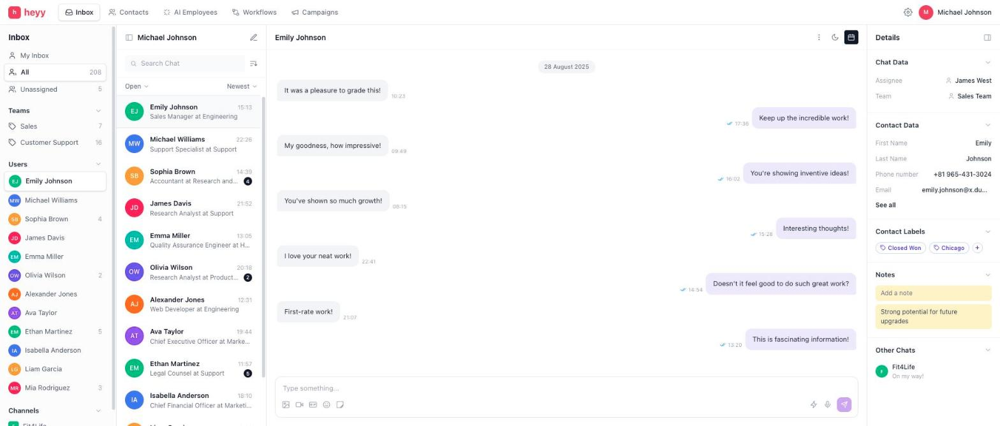
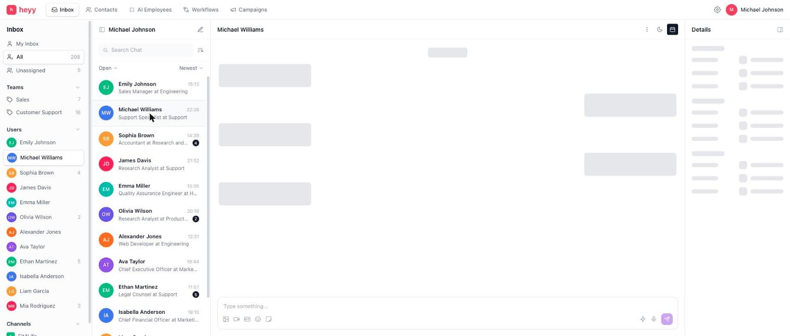
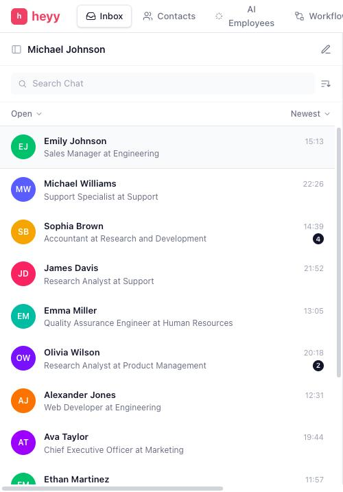
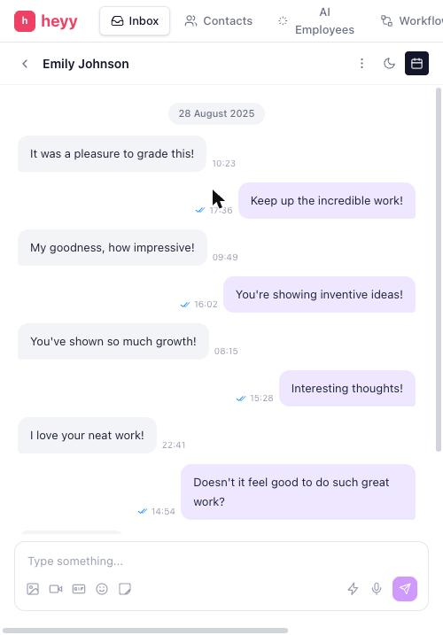

# heyy — Inbox Dashboard

Front-end screening assignment: a pixel-focused implementation of the **heyy Inbox Dashboard** Figma design, built with **React + TypeScript + Tailwind CSS** and powered by live dummy APIs.

## 📸 Screenshots

### Boot loading state — "Extracting Information..."
Shown while the initial data loads, matching the Figma loading frame.


### Inbox Dashboard (loaded)
Top navigation, sidebar, conversation list, message thread and details panel — all data from live APIs.



### Skeleton state
Thread and details panel render grey pulsing skeletons while their API calls are in flight.



### Responsive (mobile)
The chat list and thread swap on small screens, with a back button in the thread header.

| Chat list | Thread |
| --- | --- |
|  |  |

## ✨ Features

- **Boot loading state** — full-screen *"Extracting Information..."* screen (animated ring + hexagon icons) shown while the initial data loads, exactly like the Figma loading frame.
- **Skeleton states** — the chat list, message thread, sidebar users and details panel all render grey pulsing skeletons (matching the Figma skeleton frame) while their API calls are in flight.
- **Live API integration** — users, conversations and messages are fetched from [dummyjson.com](https://dummyjson.com). Includes proper loading, error + retry, and empty states.
- **4-column dashboard layout** — top navigation, inbox sidebar (filters / teams / users / channels), searchable conversation list, message thread with composer, and contact details panel.
- **Interactions**
  - Select a conversation → thread + details update (each chat pulls its own message slice from the API).
  - **Search chats** — debounced server-side search against `dummyjson.com/users/search`.
  - **Send a message** — appears instantly as an outgoing bubble; composer clears and the thread auto-scrolls.
  - Collapsible sections in the details panel, add labels and notes.
- **Responsive** — the sidebar hides below `lg`, the details panel below `xl`; the core list + thread stay usable on smaller screens.

## 🚀 Setup

```bash
npm install
npm run dev      # start dev server
npm run build    # type-check + production build
npm run preview  # preview the production build
```

Requires Node 18+.

## 🔌 APIs used

| Endpoint | Used for |
| --- | --- |
| `GET https://dummyjson.com/users?limit=12&select=...` | Conversation list, sidebar users, contact details |
| `GET https://dummyjson.com/users/search?q=...` | Debounced chat search |
| `GET https://dummyjson.com/comments?limit=10&skip=N` | Message thread (each conversation pulls a distinct slice) |

All fetching goes through a small `fetchJson` client (`src/api/client.ts`) and a generic `useFetch` hook (`src/hooks/useFetch.ts`) that handles abort-on-unmount, status flags (`loading / success / error`) and retry.

## 🗂 Project structure

```
src/
  api/          # fetch client + dummyjson endpoints
  hooks/        # useFetch (generic data-fetching hook)
  types/        # shared TypeScript types
  utils/        # formatting helpers (initials, avatar colors, timestamps)
  components/
    icons.tsx   # inline SVG icon set
    ui/         # Skeleton, Avatar, ErrorState, CollapsibleSection
    loading/    # ExtractingScreen (boot loading state)
    layout/     # TopNav
    sidebar/    # InboxSidebar
    chatlist/   # ChatList
    thread/     # ChatThread (bubbles + composer)
    details/    # DetailsPanel
  App.tsx       # data wiring + layout
```

## 📌 Assumptions

- The Figma file contains three dashboard frames (skeleton state, BOXpad branding, heyy branding); the **heyy** version was treated as the final design, and the skeleton frame as the loading state for the same screen.
- dummyjson has no real conversation model, so messages are mapped from `comments` (alternating incoming/outgoing) and timestamps are derived deterministically so the UI stays stable.
- Static design copy (assignee "James West", team "Sales Team", date chip "28 August 2025", channel "Fit4Life") is kept as in the design where the APIs have no equivalent.
- A minimum display time is applied to the boot screen so the loading state is actually visible on fast connections.
